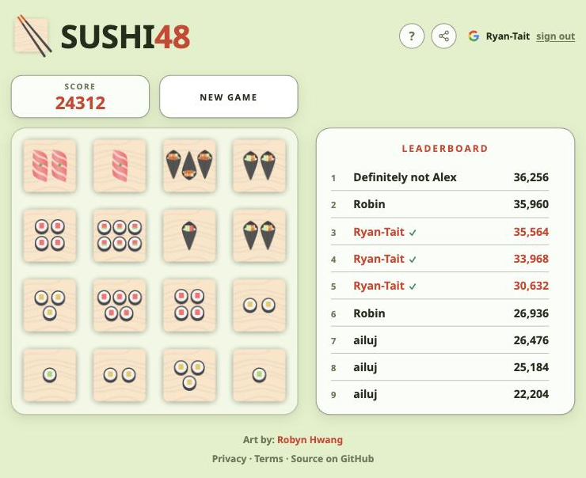
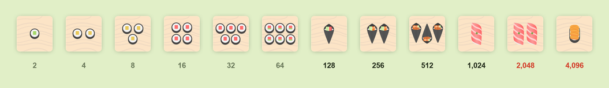
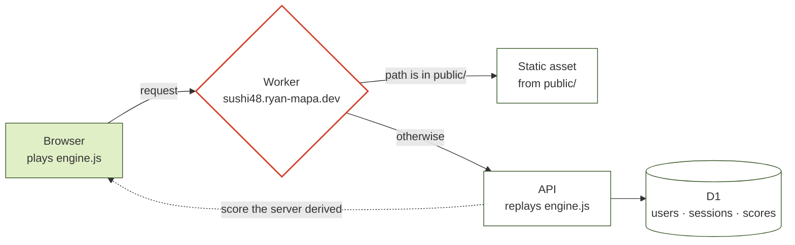

# SUSHI48

A sushi themed version of the popular 2048 game, with a leaderboard nobody can
cheat.

**▶ Play: https://sushi48.ryan-mapa.dev**

<p align="center">
  
</p>



Arrow keys on desktop, swipe on a phone. Combine matching sushi to climb the
chain. Art by [Robyn Hwang](https://www.robynhwang.com/).

|  |  |
|---|---|
| **Verified scores** | The server replays your moves and derives the score itself. Nothing the browser claims about its score is read. |
| **Optional sign-in** | Play and post anonymously, or sign in with Google to make a name yours. Never required. |
| **Challenge links** | Share a link carrying your score; whoever opens it is told what to beat. |
| **No build step** | `public/source/` is plain ES modules, loaded straight by the browser. |
| **Endless** | A matching pair at the top of the chain vanishes, so the board never clogs. |


## Rules

Canonical 2048 — a merge awards the combined value, and a tile merges at most
once per move.

The sushi art stops at nigiri-uni, so **4096 is the highest tile**. Rather than
letting the board clog with un-mergeable tiles, a matching pair at the cap
**vanishes**, clearing both cells and scoring 8192 points. Play can continue
indefinitely.

The cap was 2048 under ruleset 1, when uni sat at the top. Adding the pair of
toro at 2048 pushed uni up a rung and the cap moved with it — which is what
`RULESET_VERSION` exists to record. A move log is only ever replayed under the
rules it was played under. Scores from every ruleset share one leaderboard: a
merging pair pays twice the tile value under both, so they stay comparable.


## Architecture

One Cloudflare Worker serves everything, on the custom domain
`sushi48.ryan-mapa.dev`. Requests matching a file in `public/` are served as
static assets; everything else falls through to the API. One origin means no
CORS, and auth can use an HttpOnly cookie that page scripts cannot read.

Static assets are served extensionless — `/privacy` is canonical and
`/privacy.html` redirects to it.



The browser and the Worker load **the same `engine.js`**. The browser plays it;
the Worker replays your move log through it and derives the score. That is the
whole trust model — the client is a renderer and an input recorder, and nothing
it says about its own score is ever read.

Sharing one rules file is the whole reason this runs on Workers: the verifier
and the game cannot drift apart.

There is no build step. `public/source/` is plain ES modules loaded directly by
the browser.

| Path | What it is |
|---|---|
| `public/` | Everything served to browsers. Nothing outside it is reachable. |
| `public/index.html` | The page |
| `public/2048.js` | Composition root; wires game, leaderboard and overlay together |
| `public/source/engine.js` | **Pure game rules.** No DOM, no clock. Runs in browser *and* Worker |
| `public/source/rng.js` | Seeded PRNG (mulberry32) — the only randomness in the system |
| `public/source/game.js` | Input handling, move recording, 250 ms debounce |
| `public/source/renderer.js` | Owns all board DOM and the merge/spawn animations |
| `public/source/api.js` | Same-origin API calls, pending-run buffer |
| `public/source/leaderboard.js` | Score table rendering |
| `public/source/overlay.js` | Game-over dialog |
| `public/source/share.js` | Share text, challenge links, and parsing untrusted ones |
| `public/source/google-button.js` | Google's standard sign-in button, per their branding rules |
| `docs/` | README images only. Not served. |
| `public/privacy.html`, `public/terms.html` | Policy pages, served at `/privacy` and `/terms` |
| `worker/src/index.js` | Routing, validation, replay, D1, OAuth, cleanup cron |
| `worker/src/auth.js` | JWT sign/verify and salted IP hashing (Web Crypto, no deps) |
| `test/` | Engine rules, replay determinism, DOM rendering |

Full API reference and operational notes: [worker/README.md](worker/README.md).

## Development

```sh
npm install
npm --prefix worker install
npm --prefix worker run schema:local   # first time only
npm run dev                            # game + API on http://localhost:8787
```

`npm run dev` runs `wrangler dev`, serving `public/` and the API together
exactly as production does. Sign-in will not work locally without a real
Google OAuth client pointed at localhost; everything else does, including
anonymous score posting.

```sh
npm test        # 76 tests
npm run watch   # re-run on change
```

The tests worth knowing about:

- `test/engine.test.js` — merge rules, including the `[2,2,4] → [4,4]`
  regression guarding against chain-merging, and the cap-vanish behaviour.
- `test/determinism.test.js` — the load-bearing one. A seed plus a move log
  must produce a byte-identical game every time, or replay verification is
  worthless.
- `test/render.test.js` — DOM rendering, keyboard and swipe handling under
  happy-dom, including the 40px swipe threshold.
- `test/names.test.js` — the two name rules: a typed name is rejected when too
  long, an OAuth profile name is truncated.
- `test/share.test.js` — challenge links round-trip, and a hand-edited one
  cannot smuggle anything through: the score is coerced to a plausible integer
  and the name is stripped and clipped.

## Deploying

```sh
cd worker && npm run deploy
```

That uploads the Worker and everything in `public/` in one shot.

**Deploys are manual.** Cloudflare has no connection to this repository —
merging a PR does not ship anything, and the live site is whatever
`wrangler deploy` last uploaded. See [worker/README.md](worker/README.md) for
first-time setup, secrets, and the D1 schema.
